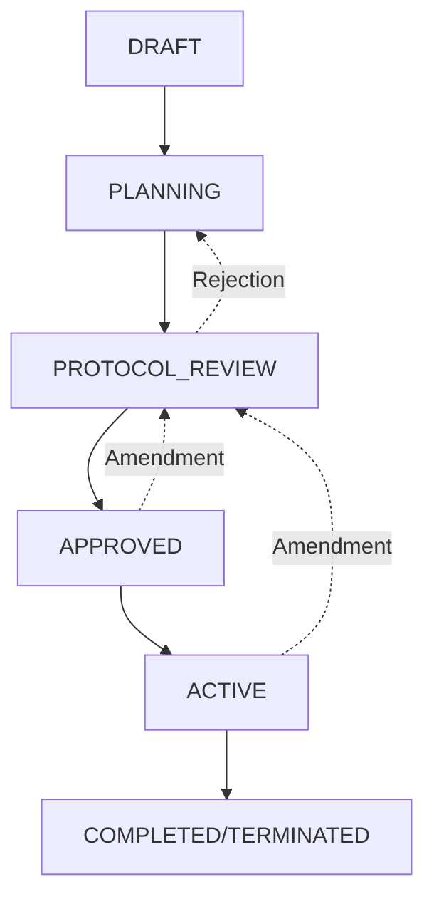
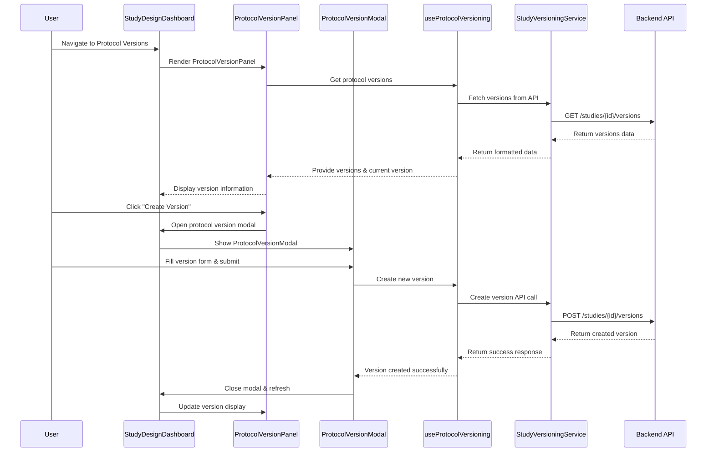

# ClinPrecision Study Lifecycle & Protocol Version Management

## Overview

This document explains the comprehensive study lifecycle management system in ClinPrecision, including study status workflows, design phase management, and the dual-versioning system for studies and protocols.

## Table of Contents

1. [Study Lifecycle Status Workflow](#study-lifecycle-status-workflow)
2. [Study Design Workflow Integration](#study-design-workflow-integration)
3. [Study Versions vs Protocol Versions](#study-versions-vs-protocol-versions)
4. [Workflow Integration Examples](#workflow-integration-examples)
5. [Technical Implementation](#technical-implementation)
6. [API Integration](#api-integration)
7. [User Interface Components](#user-interface-components)

---

## Study Lifecycle Status Workflow

### Status Hierarchy

The study lifecycle follows a controlled progression through these states:



### Status Definitions

| Status | Code | Description | Allows Modification | Is Final | UI Behavior |
|--------|------|-------------|-------------------|----------|-------------|
| **DRAFT** | `DRAFT` | Study in initial planning phase | ✅ Yes | ❌ No | Full editing capabilities |
| **PLANNING** | `PLANNING` | Study design being finalized | ✅ Yes | ❌ No | Design workflow active |
| **PROTOCOL_REVIEW** | `PROTOCOL_REVIEW` | Under protocol review | ❌ No | ❌ No | Read-only with status indicator |
| **APPROVED** | `APPROVED` | Study approved and ready to start | ❌ No | ❌ No | Ready for activation |
| **ACTIVE** | `ACTIVE` | Study actively enrolling participants | ❌ No | ❌ No | Data capture enabled |
| **COMPLETED** | `COMPLETED` | Study successfully completed | ❌ No | ✅ Yes | Historical view only |
| **TERMINATED** | `TERMINATED` | Study terminated before completion | ❌ No | ✅ Yes | Historical view only |

### Status Transition Rules

```javascript
// Allowed transitions
const ALLOWED_TRANSITIONS = {
    'DRAFT': ['PLANNING'],
    'PLANNING': ['PROTOCOL_REVIEW'],
    'PROTOCOL_REVIEW': ['APPROVED', 'PLANNING'], // Can reject back to planning
    'APPROVED': ['ACTIVE', 'PROTOCOL_REVIEW'],   // Can amend or activate
    'ACTIVE': ['COMPLETED', 'TERMINATED', 'PROTOCOL_REVIEW'], // Can complete, terminate, or amend
    'COMPLETED': [], // Final state
    'TERMINATED': []  // Final state
};
```

### Database Schema

```sql
CREATE TABLE study_status (
    id BIGINT AUTO_INCREMENT PRIMARY KEY,
    code VARCHAR(100) NOT NULL UNIQUE,
    name VARCHAR(200) NOT NULL UNIQUE,
    description TEXT,
    display_order INTEGER NOT NULL,
    is_active BOOLEAN DEFAULT TRUE,
    allows_modification BOOLEAN DEFAULT TRUE,
    is_final_status BOOLEAN DEFAULT FALSE,
    created_at TIMESTAMP DEFAULT CURRENT_TIMESTAMP,
    updated_at TIMESTAMP DEFAULT CURRENT_TIMESTAMP ON UPDATE CURRENT_TIMESTAMP
);

-- Studies table references study_status
CREATE TABLE studies (
    id BIGINT AUTO_INCREMENT PRIMARY KEY,
    study_identifier VARCHAR(100) NOT NULL UNIQUE,
    title VARCHAR(500) NOT NULL,
    study_status_id BIGINT,
    protocol_version VARCHAR(50),
    -- ... other fields
    FOREIGN KEY (study_status_id) REFERENCES study_status(id)
);
```

---

## Study Design Workflow Integration

### Design Phases Overview

The Study Design Workflow operates **within** the study status lifecycle, providing structured steps for configuring study parameters:

```javascript
const designPhases = [
    {
        id: 'basic-info',
        name: 'Basic Information',
        description: 'Study registration and basic details',
        availableInStatus: ['DRAFT', 'PLANNING']
    },
    {
        id: 'arms',
        name: 'Study Arms', 
        description: 'Configure treatment arms and interventions',
        availableInStatus: ['DRAFT', 'PLANNING']
    },
    {
        id: 'visits',
        name: 'Visit Schedule',
        description: 'Design visit timeline and procedures', 
        availableInStatus: ['DRAFT', 'PLANNING']
    },
    {
        id: 'forms',
        name: 'Form Binding',
        description: 'Bind forms to visits and configure rules',
        availableInStatus: ['DRAFT', 'PLANNING']
    },
    {
        id: 'review',
        name: 'Review & Validation',
        description: 'Review design and validate configuration',
        availableInStatus: ['PLANNING'],
        triggersStatusChange: 'PROTOCOL_REVIEW'
    },
    {
        id: 'publish',
        name: 'Publish Study',
        description: 'Publish study for data capture',
        availableInStatus: ['APPROVED'],
        triggersStatusChange: 'ACTIVE'
    },
    {
        id: 'protocol-versions',
        name: 'Protocol Versions',
        description: 'Manage protocol versions and amendments',
        availableInStatus: ['DRAFT', 'PLANNING', 'ACTIVE', 'APPROVED']
    }
];
```

### Phase Accessibility Logic

```javascript
const isPhaseAccessible = (phaseId, studyStatus, completedPhases) => {
    const phase = designPhases.find(p => p.id === phaseId);
    
    // Check if study status allows this phase
    if (!phase.availableInStatus.includes(studyStatus)) {
        return false;
    }
    
    // Special logic for sequential phases
    if (['basic-info', 'arms', 'visits', 'forms', 'review'].includes(phaseId)) {
        return true; // Development mode - allow all design phases
    }
    
    // Publishing requires review completion
    if (phaseId === 'publish') {
        return completedPhases.includes('review') && studyStatus === 'APPROVED';
    }
    
    // Protocol versions always accessible (when status allows)
    if (phaseId === 'protocol-versions') {
        return true;
    }
    
    return false;
};
```

### Design Progress Tracking

```javascript
// Progress data structure
const designProgress = {
    'basic-info': { 
        completed: true, 
        percentage: 100, 
        lastUpdated: '2024-01-15T10:30:00Z' 
    },
    'arms': { 
        completed: false, 
        percentage: 60, 
        lastUpdated: '2024-01-16T14:45:00Z' 
    },
    'visits': { 
        completed: false, 
        percentage: 0, 
        lastUpdated: null 
    },
    // ... other phases
};
```

---

## Study Versions vs Protocol Versions

### Two-Level Versioning System

ClinPrecision implements a sophisticated dual-versioning system to handle both structural study changes and protocol document management:

#### **Study Versions** (Higher Level)
- **Purpose**: Track major study configuration changes
- **Scope**: Entire study design (arms, visits, forms, randomization)
- **Storage**: Study versioning tables with JSON change logs
- **Triggers**: Structural modifications, major amendments
- **API**: `StudyVersioningService.js`

#### **Protocol Versions** (Document Level)
- **Purpose**: Track protocol document versions and amendments  
- **Scope**: Protocol document content, version numbering, approval workflow
- **Storage**: Protocol-specific version management
- **Triggers**: Document changes, regulatory submissions, approvals
- **API**: `useProtocolVersioning.js` hook

### Version Relationship Architecture

```javascript
// Study Version (structural changes)
StudyVersion {
    id: "study_v2.0",
    studyId: "STUDY-001", 
    versionNumber: "2.0",
    amendmentType: "MAJOR",           // MINOR, MAJOR, SUBSTANTIAL
    status: "ACTIVE",
    effectiveDate: "2024-02-01",
    changes: {
        studyArms: [                  // What changed in study structure
            {
                action: "ADDED",
                armName: "Arm C - Combination Therapy",
                details: { /* arm configuration */ }
            }
        ],
        visitSchedule: [
            {
                action: "MODIFIED", 
                visitName: "Week 12 Follow-up",
                changes: ["Added PK sampling"]
            }
        ],
        forms: [/* form changes */]
    },
    protocolVersionId: "protocol_v2.1",  // References associated protocol
    regulatorySubmissions: [
        {
            authority: "FDA",
            submissionType: "AMENDMENT",
            submissionDate: "2024-01-15",
            status: "SUBMITTED"
        }
    ]
}

// Protocol Version (document management)
ProtocolVersion {
    id: "protocol_v2.1",
    studyId: "STUDY-001",
    versionNumber: "2.1",
    status: "APPROVED",               // DRAFT → PROTOCOL_REVIEW → APPROVED → ACTIVE
    amendmentType: "MINOR",           // INITIAL, MINOR, MAJOR, SUBSTANTIAL  
    description: "Updated safety reporting requirements per FDA feedback",
    effectiveDate: "2024-02-01",
    createdDate: "2024-01-10T09:00:00Z",
    approvedDate: "2024-01-25T16:30:00Z",
    createdBy: "Dr. Sarah Johnson",
    approvedBy: "Dr. Michael Chen",
    
    // Document-specific fields
    documentChanges: [
        {
            section: "6.2 Safety Reporting",
            changeType: "MODIFIED",
            description: "Updated SAE reporting timeline from 24h to 12h"
        }
    ],
    regulatoryApprovals: [
        {
            authority: "FDA", 
            approvalDate: "2024-01-25",
            referenceNumber: "IND-12345-A2"
        }
    ]
}
```

### Protocol Version Status Workflow

```javascript
const PROTOCOL_VERSION_STATUS = {
    DRAFT: {
        value: 'DRAFT',
        label: 'Draft', 
        description: 'Protocol version in development',
        canEdit: true,
        canSubmit: true,
        canApprove: false,
        canActivate: false,
        color: 'bg-gray-100 text-gray-700'
    },
    PROTOCOL_REVIEW: {
        value: 'PROTOCOL_REVIEW',
        label: 'Under Review',
        description: 'Under protocol review by regulatory team',
        canEdit: false,
        canSubmit: false, 
        canApprove: true,
        canActivate: false,
        color: 'bg-yellow-100 text-yellow-700'
    },
    APPROVED: {
        value: 'APPROVED',
        label: 'Approved',
        description: 'Protocol version approved and ready for activation',
        canEdit: false,
        canSubmit: false,
        canApprove: false,
        canActivate: true,
        color: 'bg-green-100 text-green-700'
    },
    ACTIVE: {
        value: 'ACTIVE',
        label: 'Active',
        description: 'Currently active protocol version',
        canEdit: false,
        canSubmit: false,
        canApprove: false,
        canActivate: false,
        color: 'bg-blue-100 text-blue-700'
    },
    SUPERSEDED: {
        value: 'SUPERSEDED', 
        label: 'Superseded',
        description: 'Replaced by newer version',
        canEdit: false,
        canSubmit: false,
        canApprove: false,
        canActivate: false,
        color: 'bg-orange-100 text-orange-700'
    },
    WITHDRAWN: {
        value: 'WITHDRAWN',
        label: 'Withdrawn',
        description: 'Protocol version withdrawn',
        canEdit: false,
        canSubmit: false,
        canApprove: false,
        canActivate: false,
        color: 'bg-red-100 text-red-700'
    }
};
```

### Amendment Types

```javascript
const AMENDMENT_TYPES = {
    INITIAL: {
        label: 'Initial Version',
        description: 'First version of the protocol',
        requiresRegulatory: true,
        impactLevel: 'HIGH'
    },
    MINOR: {
        label: 'Minor Amendment',
        description: 'Administrative or clarifying changes',
        requiresRegulatory: false,
        impactLevel: 'LOW'
    },
    MAJOR: {
        label: 'Major Amendment', 
        description: 'Significant changes to study design',
        requiresRegulatory: true,
        impactLevel: 'MEDIUM'
    },
    SUBSTANTIAL: {
        label: 'Substantial Amendment',
        description: 'Changes affecting safety or scientific validity',
        requiresRegulatory: true,
        impactLevel: 'HIGH'
    }
};
```

---

## Workflow Integration Examples

### Scenario 1: New Study Creation

```javascript
// Step-by-step workflow
const newStudyWorkflow = async () => {
    // 1. Initial Study Creation
    const study = await StudyService.createStudy({
        title: "COVID-19 Vaccine Efficacy Trial",
        status: "DRAFT"
    });
    
    // 2. Design Phase Progression
    await completeDesignPhase('basic-info', {
        indication: "COVID-19 Prevention",
        primaryObjective: "Demonstrate vaccine efficacy"
    });
    
    await completeDesignPhase('arms', {
        arms: [
            { name: "Vaccine Group", intervention: "COVID-19 Vaccine" },
            { name: "Placebo Group", intervention: "Placebo" }
        ]
    });
    
    await completeDesignPhase('visits', {
        schedule: [
            { visit: "Screening", day: -7 },
            { visit: "Baseline", day: 0 },
            { visit: "Week 4", day: 28 },
            { visit: "Week 12", day: 84 }
        ]
    });
    
    await completeDesignPhase('forms', {
        bindings: [
            { form: "Demographics", visits: ["Screening"] },
            { form: "Vital Signs", visits: ["Baseline", "Week 4", "Week 12"] }
        ]
    });
    
    // 3. Create Initial Protocol Version
    const protocolVersion = await ProtocolVersioning.createVersion(study.id, {
        versionNumber: "1.0",
        amendmentType: "INITIAL",
        description: "Initial protocol version",
        status: "DRAFT"
    });
    
    // 4. Submit for Review (triggers status changes)
    await StudyDesignService.submitForReview(study.id);
    // Study Status: DRAFT → PLANNING → PROTOCOL_REVIEW
    // Protocol Version: DRAFT → PROTOCOL_REVIEW
    
    // 5. External Approval Process
    await ProtocolVersioning.approveVersion(protocolVersion.id);
    await StudyService.changeStatus(study.id, "APPROVED");
    // Protocol Version: PROTOCOL_REVIEW → APPROVED
    // Study Status: PROTOCOL_REVIEW → APPROVED
    
    // 6. Study Activation
    await StudyService.publishStudy(study.id);
    await ProtocolVersioning.activateVersion(protocolVersion.id);
    // Study Status: APPROVED → ACTIVE
    // Protocol Version: APPROVED → ACTIVE
};
```

### Scenario 2: Minor Protocol Amendment

```javascript
const minorAmendmentWorkflow = async (studyId) => {
    // Current State: Study ACTIVE, Protocol v1.0 ACTIVE
    
    // 1. Create Amendment
    const amendment = await ProtocolVersioning.createVersion(studyId, {
        versionNumber: "1.1",
        amendmentType: "MINOR",
        description: "Updated contact information for study coordinator",
        effectiveDate: "2024-02-01"
    });
    // New Protocol Version: v1.1 DRAFT
    // Study Status: remains ACTIVE (no design changes)
    
    // 2. Submit Amendment for Review
    await ProtocolVersioning.submitForReview(amendment.id);
    // Protocol Version: DRAFT → PROTOCOL_REVIEW
    
    // 3. Fast-track Approval (minor amendment)
    await ProtocolVersioning.approveVersion(amendment.id);
    // Protocol Version: PROTOCOL_REVIEW → APPROVED
    
    // 4. Activate Amendment
    await ProtocolVersioning.activateVersion(amendment.id);
    // Protocol Version v1.1: APPROVED → ACTIVE
    // Protocol Version v1.0: ACTIVE → SUPERSEDED
};
```

### Scenario 3: Major Study Design Change

```javascript
const majorAmendmentWorkflow = async (studyId) => {
    // Current State: Study ACTIVE, Protocol v2.0 ACTIVE
    
    // 1. Modify Study Design
    await StudyDesignDashboard.navigateToPhase('arms');
    await StudyArmsDesigner.addArm({
        name: "Arm C - Combination Therapy",
        intervention: "Vaccine + Booster"
    });
    
    // 2. Create Study Version (captures design changes)
    const studyVersion = await StudyVersioningService.createVersion(studyId, {
        amendmentType: "MAJOR",
        reason: "Add combination therapy arm based on interim analysis",
        changes: {
            studyArms: ["ADDED: Arm C - Combination Therapy"],
            visitSchedule: ["MODIFIED: Added PK sampling visits"],
            randomization: ["UPDATED: 1:1:1 randomization ratio"]
        }
    });
    
    // 3. Create Corresponding Protocol Version
    const protocolVersion = await ProtocolVersioning.createVersion(studyId, {
        versionNumber: "3.0",
        amendmentType: "MAJOR", 
        description: "Addition of combination therapy arm and modified visit schedule",
        studyVersionId: studyVersion.id, // Link to study version
        effectiveDate: "2024-03-01"
    });
    
    // 4. Submit for Regulatory Review
    await StudyService.changeStatus(studyId, "PROTOCOL_REVIEW");
    await ProtocolVersioning.submitForReview(protocolVersion.id);
    // Study Status: ACTIVE → PROTOCOL_REVIEW  
    // Protocol Version: DRAFT → PROTOCOL_REVIEW
    
    // 5. Regulatory Approval Process
    await ProtocolVersioning.approveVersion(protocolVersion.id);
    await StudyService.changeStatus(studyId, "APPROVED");
    // Protocol Version: PROTOCOL_REVIEW → APPROVED
    // Study Status: PROTOCOL_REVIEW → APPROVED
    
    // 6. Implement Changes
    await StudyService.publishAmendment(studyId);
    await ProtocolVersioning.activateVersion(protocolVersion.id);
    await StudyVersioningService.activateVersion(studyVersion.id);
    // Study Status: APPROVED → ACTIVE
    // Protocol Version v3.0: APPROVED → ACTIVE
    // Protocol Version v2.0: ACTIVE → SUPERSEDED
    // Study Version: Activated with new design
};
```

---

## Technical Implementation

### Backend Architecture

#### Study Status Management
```javascript
// StudyDesignService.js
class StudyDesignService {
    async changeStudyStatus(studyId, newStatus) {
        // Validate status transition
        const currentStudy = await this.getStudyById(studyId);
        const currentStatus = currentStudy.studyStatus.code;
        
        if (!this.isValidTransition(currentStatus, newStatus)) {
            throw new Error(`Invalid status transition: ${currentStatus} → ${newStatus}`);
        }
        
        // Update study status
        const response = await ApiService.patch(`/api/studies/${studyId}/status`, { 
            newStatus: newStatus 
        });
        
        return response.data;
    }
    
    isValidTransition(from, to) {
        const allowedTransitions = {
            'DRAFT': ['PLANNING'],
            'PLANNING': ['PROTOCOL_REVIEW'],
            'PROTOCOL_REVIEW': ['APPROVED', 'PLANNING'],
            'APPROVED': ['ACTIVE', 'PROTOCOL_REVIEW'],
            'ACTIVE': ['COMPLETED', 'TERMINATED', 'PROTOCOL_REVIEW']
        };
        
        return allowedTransitions[from]?.includes(to) || false;
    }
}
```

#### Protocol Version Management
```javascript
// useProtocolVersioning.js
export const useProtocolVersioning = (studyId) => {
    const [versions, setVersions] = useState([]);
    const [currentVersion, setCurrentVersion] = useState(null);
    const [loading, setLoading] = useState(false);
    
    const createVersion = useCallback(async (versionData) => {
        setLoading(true);
        try {
            const response = await StudyVersioningService.createVersion(studyId, {
                ...versionData,
                studyId: studyId
            });
            
            await loadVersions(); // Refresh list
            return response;
        } catch (error) {
            console.error('Error creating protocol version:', error);
            throw error;
        } finally {
            setLoading(false);
        }
    }, [studyId]);
    
    const submitForReview = useCallback(async (versionId) => {
        const response = await StudyVersioningService.updateVersionStatus(
            studyId, versionId, 'PROTOCOL_REVIEW'
        );
        await loadVersions();
        return response;
    }, [studyId]);
    
    // ... other version management functions
    
    return {
        versions,
        currentVersion,
        loading,
        createVersion,
        submitForReview,
        approveVersion,
        activateVersion,
        // ... other functions
    };
};
```

### Frontend Components

#### StudyDesignDashboard Integration
```jsx
const StudyDesignDashboard = () => {
    const { studyId } = useParams();
    const [study, setStudy] = useState(null);
    const [currentPhase, setCurrentPhase] = useState('basic-info');
    const protocolVersioning = useProtocolVersioning(studyId);
    
    // Status-driven UI rendering
    const renderPhaseContent = () => {
        const studyStatus = study?.studyStatus?.code;
        
        switch (currentPhase) {
            case 'basic-info':
                return (
                    <BasicInfoSummary 
                        study={study} 
                        editable={['DRAFT', 'PLANNING'].includes(studyStatus)}
                    />
                );
                
            case 'protocol-versions':
                return (
                    <ProtocolVersionPanel
                        studyId={studyId}
                        currentProtocolVersion={protocolVersioning.currentVersion}
                        protocolVersions={protocolVersioning.versions}
                        onCreateVersion={handleCreateProtocolVersion}
                        onManageVersions={handleManageProtocolVersions}
                    />
                );
                
            case 'review':
                return (
                    <StudyReviewPanel
                        study={study}
                        onSubmitForReview={handleSubmitForReview}
                        canSubmit={studyStatus === 'PLANNING'}
                    />
                );
                
            default:
                return <div>Phase not implemented</div>;
        }
    };
    
    return (
        <div className="study-design-dashboard">
            <StudyContextHeader study={study} currentPhase={currentPhase} />
            <WorkflowProgressTracker 
                phases={designPhases}
                currentPhase={currentPhase}
                studyStatus={study?.studyStatus?.code}
            />
            <div className="phase-content">
                {renderPhaseContent()}
            </div>
        </div>
    );
};
```

#### Status-Based UI Components
```jsx
const StudyStatusIndicator = ({ study }) => {
    const getStatusDisplay = (status) => {
        const displays = {
            'DRAFT': { color: 'bg-gray-100', icon: FileText, label: 'Draft' },
            'PLANNING': { color: 'bg-blue-100', icon: Target, label: 'Planning' },
            'PROTOCOL_REVIEW': { color: 'bg-yellow-100', icon: Clock, label: 'Under Review' },
            'APPROVED': { color: 'bg-green-100', icon: CheckCircle, label: 'Approved' },
            'ACTIVE': { color: 'bg-blue-100', icon: Play, label: 'Active' }
        };
        return displays[status] || displays['DRAFT'];
    };
    
    const display = getStatusDisplay(study.studyStatus?.code);
    const StatusIcon = display.icon;
    
    return (
        <div className={`flex items-center gap-2 px-3 py-1 rounded-full ${display.color}`}>
            <StatusIcon className="h-4 w-4" />
            <span className="text-sm font-medium">{display.label}</span>
        </div>
    );
};
```

---

## API Integration

### RESTful Endpoints

#### Study Management
```javascript
// Study status operations
GET    /api/studies/{studyId}
PATCH  /api/studies/{studyId}/status
POST   /api/studies/{studyId}/submit-for-review
POST   /api/studies/{studyId}/publish

// Study design progress
GET    /api/studies/{studyId}/design-progress
PUT    /api/studies/{studyId}/design-progress
POST   /api/studies/{studyId}/design-progress/initialize
```

#### Protocol Version Management
```javascript
// Protocol version CRUD
GET    /api/studies/{studyId}/versions
POST   /api/studies/{studyId}/versions
GET    /api/studies/{studyId}/versions/{versionId}
PUT    /api/studies/{studyId}/versions/{versionId}
DELETE /api/studies/{studyId}/versions/{versionId}

// Version status management
PATCH  /api/studies/{studyId}/versions/{versionId}/status
POST   /api/studies/{studyId}/versions/{versionId}/submit-for-review
POST   /api/studies/{studyId}/versions/{versionId}/approve
POST   /api/studies/{studyId}/versions/{versionId}/activate

// Version queries
GET    /api/studies/{studyId}/versions/active
GET    /api/studies/{studyId}/versions/latest
GET    /api/studies/{studyId}/versions?status={status}
```

#### Study Versioning
```javascript
// Study version management
GET    /api/studies/{studyId}/study-versions
POST   /api/studies/{studyId}/study-versions
GET    /api/studies/{studyId}/study-versions/{versionId}
POST   /api/studies/{studyId}/study-versions/{versionId}/activate
```

### Service Integration

#### StudyVersioningService.js
```javascript
class StudyVersioningService {
    // Protocol version operations
    static async getStudyVersions(studyId) {
        const response = await ApiService.get(`/studies/${studyId}/versions`);
        return response.data;
    }
    
    static async createVersion(studyId, versionData) {
        const response = await ApiService.post(`/studies/${studyId}/versions`, versionData);
        return response.data;
    }
    
    static async updateVersionStatus(studyId, versionId, newStatus) {
        const response = await ApiService.patch(
            `/studies/${studyId}/versions/${versionId}/status`, 
            { status: newStatus }
        );
        return response.data;
    }
    
    // Study version operations
    static async createStudyVersion(studyId, versionData) {
        const response = await ApiService.post(`/studies/${studyId}/study-versions`, versionData);
        return response.data;
    }
}
```

---

## User Interface Components

### Key Components Overview

#### 1. StudyDesignDashboard.jsx
**Purpose**: Main orchestrator for study design workflow
**Features**:
- Phase navigation and progress tracking
- Status-driven UI rendering
- Protocol version management integration
- Workflow transition handling

#### 2. ProtocolVersionPanel.jsx
**Purpose**: Protocol version management interface
**Features**:
- Current version status display
- Version creation and management
- Status-based action buttons
- Version timeline integration

#### 3. ProtocolVersionManagementModal.jsx
**Purpose**: Comprehensive protocol version management
**Features**:
- Tabbed interface (Overview/Timeline/Create/Edit)
- Version CRUD operations
- Status workflow management
- Amendment type handling

#### 4. WorkflowProgressTracker.jsx
**Purpose**: Visual progress tracking for design phases
**Features**:
- Phase completion status
- Accessibility based on study status
- Progress percentage display
- Phase navigation

#### 5. StudyPublishWorkflow.jsx
**Purpose**: Study publishing and activation
**Features**:
- Final validation checks
- Status transition to ACTIVE
- Publishing configuration
- Regulatory compliance checks

### Component Interaction Flow



### Styling and UX Patterns

#### Status-Based Styling
```scss
// Status color system
.status-draft { @apply bg-gray-100 text-gray-700 border-gray-300; }
.status-planning { @apply bg-blue-100 text-blue-700 border-blue-300; }
.status-protocol-review { @apply bg-yellow-100 text-yellow-700 border-yellow-300; }
.status-approved { @apply bg-green-100 text-green-700 border-green-300; }
.status-active { @apply bg-blue-100 text-blue-700 border-blue-300; }

// Phase accessibility
.phase-accessible { @apply cursor-pointer hover:bg-gray-50; }
.phase-inaccessible { @apply opacity-50 cursor-not-allowed; }
.phase-current { @apply bg-blue-50 border-blue-200 text-blue-900; }
.phase-completed { @apply bg-green-50 border-green-200; }
```

#### Animation and Feedback
```css
/* Status transition animations */
.status-transition {
    transition: all 0.3s cubic-bezier(0.4, 0, 0.2, 1);
}

/* Loading states */
.loading-spinner {
    animation: spin 1s linear infinite;
}

/* Success/Error feedback */
.success-feedback {
    @apply bg-green-50 border-green-200 text-green-800;
    animation: slideIn 0.3s ease-out;
}

.error-feedback {
    @apply bg-red-50 border-red-200 text-red-800;
    animation: shake 0.5s ease-in-out;
}
```

---

## Conclusion

The ClinPrecision study lifecycle and protocol version management system provides a comprehensive, regulatory-compliant framework for managing clinical trials from conception through completion. The dual-versioning approach ensures both structural study changes and protocol document management are properly tracked and controlled, while the status-driven workflow ensures appropriate governance at each stage of the study lifecycle.

Key benefits of this architecture:
- **Regulatory Compliance**: Status transitions align with regulatory requirements
- **Audit Trail**: Complete versioning and change tracking
- **User Experience**: Intuitive workflow with clear status indicators
- **Flexibility**: Support for both minor and major amendments
- **Scalability**: Modular architecture supports complex study designs
- **Integration**: Seamless connection between study design and protocol management

This system supports the full complexity of modern clinical trial management while maintaining usability and compliance standards required in the pharmaceutical industry.